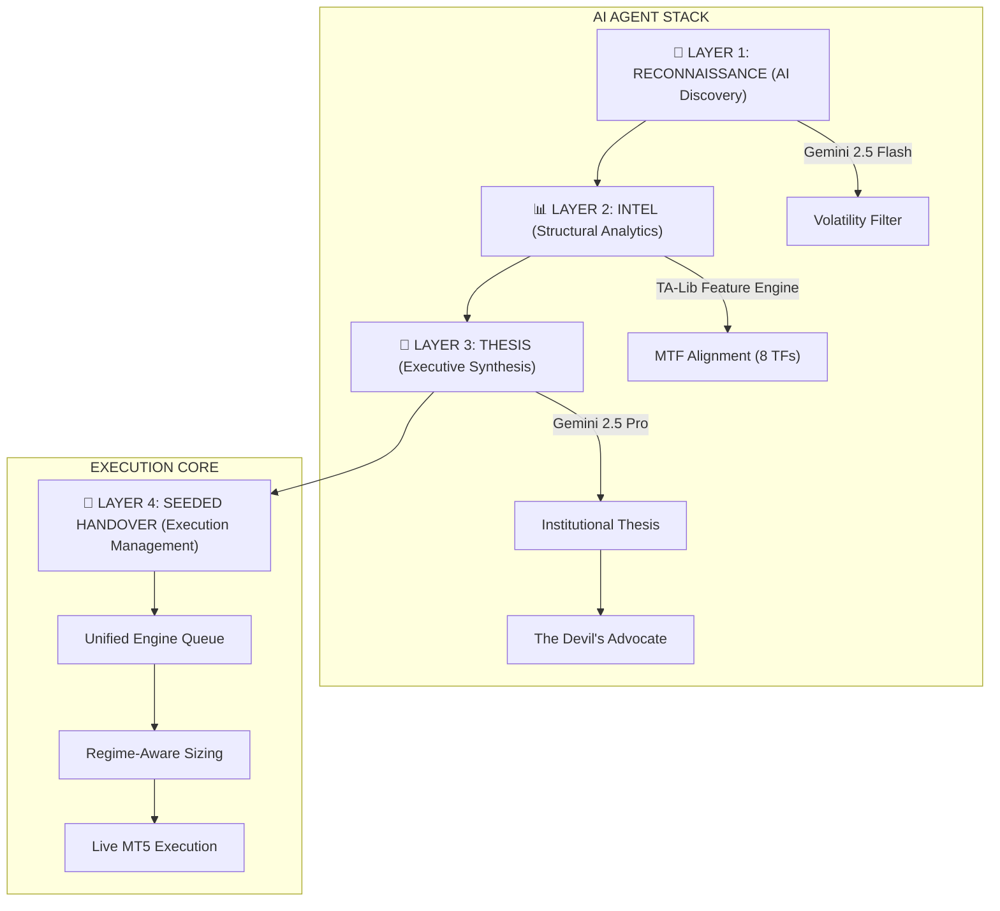

# 🔱 TITAN AI ALPHA: THE ABSOLUTE ULTIMATE COMMAND

The `/titan` command activates the system's most powerful end-to-end institutional workflow. This is not just a bot; it is a **Multi-Model Intelligence Network** designed to bridge the gap between massive market quantitative data and executive-level strategic reasoning.

---

## 🏛️ 4-LAYER "TITAN" ARCHITECTURE

The system operates on an institutional "Pipeline" model, where data flow is strictly segregated to ensure maximum reasoning quality.



---

## 🌊 THE OPERATIONAL PIPELINE: DEEP DIVE

````carousel
```markdown
### 📡 LAYER 1: RECONNAISSANCE (Discovery)
**Agent**: ReconAgent (Gemini 2.5 Flash)
**Data**: High-frequency ticks for 10+ symbols.
**Logic**: 
- Calculates "Volatility Adjusted Range" (VAR).
- Ranks symbols by Profitability Velocity (Daily Change % / Spread Cost).
- Filters noise to identify the #1 "Market Catalyst" symbol.
```
<!-- slide -->
```markdown
### 📊 LAYER 2: STRUCTURAL INTEL (Profiling)
**Engine**: TA-Lib Enhanced Profiler v3.0
**Context**: 158 institutional features calculated in real-time.
**Logic**: 
- Multi-Timeframe Alignment (8 TFs: 1M to 1W).
- Order Flow Mapping (Identifying Liquidity Sweeps & FVG).
- Sentiment Overlay (Correlation checks between Indices, Gold, and USD).
```
<!-- slide -->
```markdown
### 🧠 LAYER 3: THESIS (Strategy Synthesis)
**Agent**: StrategyAgent (Gemini 2.5 Pro)
**Logic**: Prompt Engineering v2.0 (Dual-Perspective Reasoning)
- **Primary Narrative**: Why should we be an institutional 'Shark' here?
- **The Devil's Advocate**: What is the most likely way this trade fails?
- **Seeded Parameters**: Precise Entry, SL, TP, and Risk Multipliers based on structural confidence.
```
<!-- slide -->
```markdown
### 🚀 LAYER 4: SEEDED HANDOVER (Execution)
**Bridge**: SeededExecution Protocol
**Logic**: Seamless integration into `unified_engine.py`.
- Trades are NOT instantly executed; they are "Seeded" into the pending queue.
- The Engine monitors the "Trigger Point" with millisecond precision.
- **Persistence**: The full AI report is saved to `analysis/titan_alpha/` for audit.
```
````

---

## 🎯 COMMAND USAGE & SUITE

| Command | Operational Mode | Mission Scope |
|:---:|---|---|
| **`/titan`** | **Automated Hunt** | The system scans the entire watchlist and executes the single highest-conviction setup discovered today. |
| **`/titan GOLD`** | **Sniper Protocol** | Force full intelligence resources onto a specific asset. Ideal for high-impact news days or sessions. |

---

## 🔬 INSTITUTIONAL FUNDAMENTALS

To trade with Titan Alpha is to trade with **Operational Alpha**. The system respects three core institutional pillars:

### 1. Market Regime Awareness
The system classifies every setup into one of four regimes:
- **Accumulation**: Institutions buying "under the cover" of ranges.
- **Participation**: Releasing the trend (High-speed momentum).
- **Distribution**: Smart money offloading to retail buyers.
- **Resolution**: Volatility flush before the new cycle.

### 2. Liquidity Mapping (Retail Inducement)
Titan AI looks for "Retail Traps". It specifically identifies:
- **Liquidity Sweeps**: Prices dipping below obvious support to trigger stops before rallying.
- **Fair Value Gaps (FVG)**: Efficient price moves that professional traders expect to be re-tested.
- **Order Blocks**: Large institutional buy/sell zones hidden in H4/D1 structures.

### 3. Systematic Compounding
When the AI generates a **High Confidence (>90%)** setup, the Risk Multiplier is automatically adjusted to capitalize on the edge, while the "Kill Switch" protocols remain in place for capital protection.

---

## 🛡️ RISK MATRIX & CIRCUIT BREAKERS

> [!CAUTION]
> **Operational integrity is prioritized over profit frequency.**
> - **Self-Correction**: If the AI Confidence is `< 70%`, the mission is automatically aborted with a "Insufficient Edge" log.
> - **Drawdown Protection**: Every seeded trade has a hard SL calculated by both ATR and Institutional Structure.
> - **Correlation Lock**: The system will not seed two highly correlated assets (e.g., BTC and ETH) simultaneously unless explicitly forced.

---

## ⚡ MISSION TRIGGER

**Option 1: Full Orchestrator Pipeline (Recommended)**
```powershell
# First, check system health
python titan_orchestrator.py --action health_check

# Then run the full Alpha pipeline with hooks
python scripts/titan_ai_alpha.py --symbol {{symbol}} --mode paper
```

**Option 2: Direct Execution with Hooks**
```powershell
# Pre-trade gate (REQUIRED before any execution)
python .agent/hooks/pre_trade.py --symbol {{symbol}} --direction BUY --lots 0.1

# Only if gate PASSES, proceed with execution
python titan_orchestrator.py --action execute --symbol {{symbol}} --direction BUY --lots 0.1
```

> [!IMPORTANT]
> The orchestrator now automatically:
> 1. Verifies Bridge health via `mt5_bridge` skill
> 2. Checks macro environment via `data_intelligence` skill
> 3. Identifies market regime via `alpha_research` skill
> 4. Calculates Kelly sizing via `factor_risk` skill
> 5. Logs all decisions to the Institutional Audit Trail

---
*Manual Version: 2.2 | Authority: Titan AI Alpha Executive | Date: 2026-01-16*
