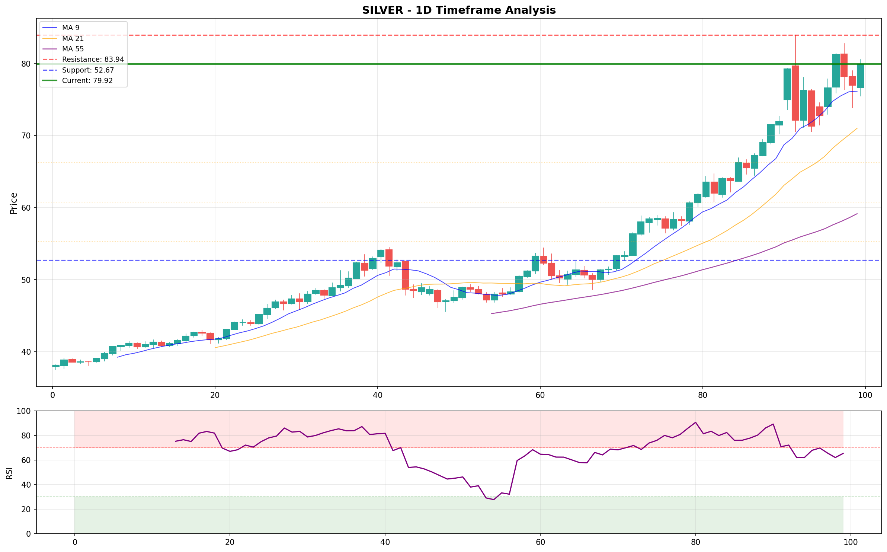
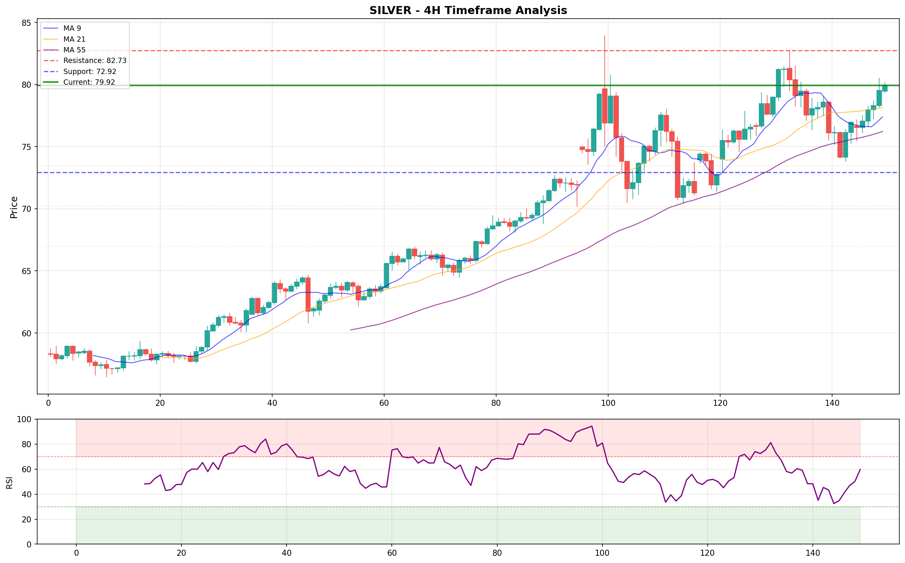
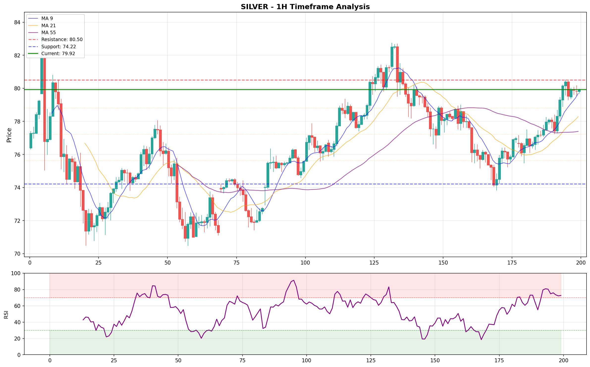

# SILVER - COMPREHENSIVE MULTI-TIMEFRAME TRADE SETUP ANALYSIS

> [!TIP]
> **DEEP QUANT RESEARCH**: [View Full TA-Lib Profiler Report (150+ Indicators)](../intelligence/SILVER_TALIB_v3_20260112_015540.md)

*Generated At: 2026-01-12 01:55:37*

## 🎯 MACRO VIEW - WEEKLY (1W)

**MEGA TREND:** ULTRA BULLISH
- **Current Level:** 79.92
- **RSI:** 80.7
- **Status:** HOLD BULLISH

***

## 📊 DAILY (1D) - BIAS CONFIRMATION

**Status:** ULTRA BULLISH
- **Support Zone:** 60.79
- **Resistance:** 83.94
- **RSI:** 65.7

***

## ⏰ 4-HOUR (4H) - STRUCTURE ANALYSIS

**Setup:** ULTRA BULLISH Structure
- **ADX Strength:** 17.8 (Developing)
- **Key Support:** 73.83
- **Key Resistance:** 82.73

***

## 🔥 30-MINUTE (30M) - CONTINUATION SETUP

**Status:** ACCUMULATING
- **RSI:** 64.9
- **Targets:** 80.50

***

## ⚡ 15-MINUTE (15M) - ENTRY TIMEFRAME

**Bias:** BULLISH
- **Entry Potential:** HIGH

***

## 🎯 5-MINUTE (5M) - SCALP/QUICK ENTRY

**Micro-Trend:** BULLISH
- **Momentum:** RISING

***

## 📈 1-MINUTE (1M)

 - EXECUTION TIMEFRAME

**Current Status:** READY TO EXECUTE
- **Price:** 79.92

***

## 🚀 FINAL TRADE SETUP RECOMMENDATION

### **PRIMARY LONG SETUP**

| Timeframe | Bias | Strength | Action |
|-----------|------|----------|--------|
| **1W** | ULTRA BULLISH | ⭐⭐⭐⭐ | BUY/HOLD |
| **1D** | ULTRA BULLISH | ⭐⭐⭐⭐⭐ | BUY/HOLD |
| **4H** | ULTRA BULLISH | ⭐⭐⭐⭐ | BUY/HOLD |
| **30M** | ULTRA BULLISH | ⭐⭐⭐⭐⭐ | BUY/HOLD |
| **15M** | BULLISH | ⭐⭐⭐⭐ | BUY/HOLD |
| **5M** | BULLISH | ⭐⭐⭐⭐ | BUY/HOLD |
| **1M** | BULLISH | ⭐⭐⭐ | BUY/HOLD |

***

### 💎 OFFICIAL TRADE SETUP

**Direction:** LONG ⬆️

**Stop Loss:** 60.79
**Targets:**
- **TP1:** 83.94
- **TP2:** 84.78

### 📊 PROBABILITY ANALYSIS

**LONG Probability:** **100%**

### ✅ EXECUTION CHECKLIST

- [ ] Entry Zone Alignment
- [ ] Stop Loss Set at 60.79
- [ ] RSI Confirmation on Execution Frame
- [ ] Volume Spike Check

## 🎯 ACTION PLAN

**Current Price**: 0.00

## 💼 TRADER-SPECIFIC RECOMMENDATIONS

### 📊 Position Traders (Weekly/Daily)

- **Bias**: NEUTRAL 🟡
- **Action**: Wait for clearer directional bias

### 🎯 Swing Traders (4H/1H)

- **Strategy**: Sell rallies to resistance
- **Hold Time**: 2-5 days

### ⚡ Day Traders (1H/15M/5M)

- **Strategy**: Trade the range or momentum
- **Breakout**: Watch for range break, trade with momentum
- **Hold Time**: Minutes to hours

## 📈 READY-TO-TRADE SETUPS

*No clear setups identified. Wait for better structure.*
