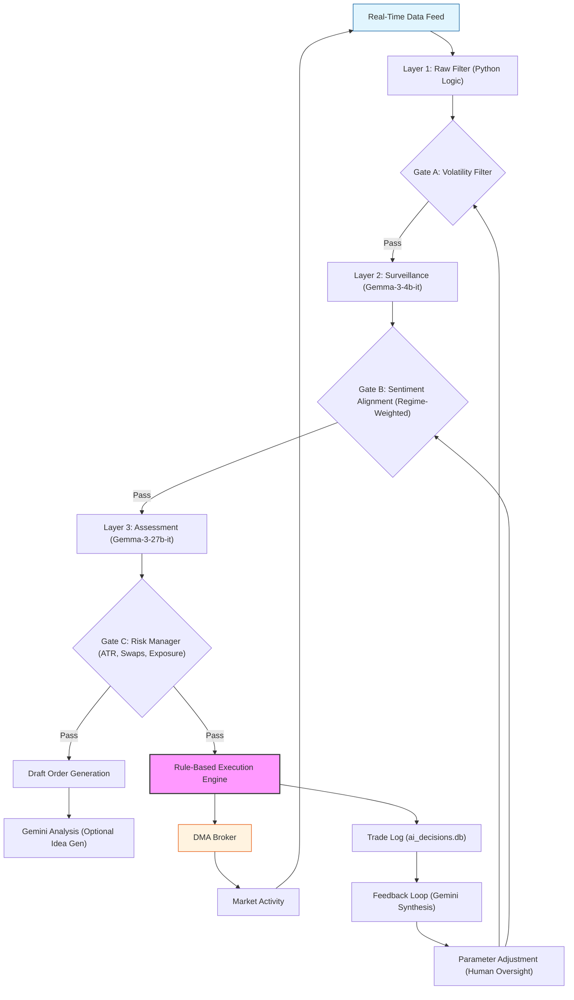

# 🏛️ TITAN STRATEGY COUNCIL: FINAL REPORT

Generated on: 2026-01-17 01:59:11

## 👑 ULTIMATE ROADMAP: THE CEO'S SYNTHESIS

## 🚀 Titan Trading: Ultimate Autonomous AI Strategy - Roadmap & Final Architecture

**To**: Titan Trading Stakeholders
**From**: [Your Name], Lead Portfolio Manager (CEO)
**Date**: October 26, 2023
**Subject**: Autonomous AI Strategy - Consolidated Feedback & Roadmap for Implementation

**Executive Summary:**

The initial “Ultimate Autonomous AI Strategy” proposal generated valuable, and often conflicting, feedback from our specialized departments. While the tiered architecture concept holds merit, significant concerns were raised regarding risk management, execution latency, reliance on LLMs for critical decisions, and the robustness of the underlying assumptions. This report synthesizes the departmental feedback, resolves key conflicts, and outlines a revised roadmap for implementation. The core principle guiding this revision is **pragmatic autonomy**: leveraging AI for analysis and idea generation, but retaining human oversight and deterministic logic for execution and risk control.  We are shifting from a fully autonomous system to a *semi-autonomous* system with robust safeguards.

**1. Consolidated Feedback Summary:**

| Department | Key Strengths | Key Weaknesses | Critical Recommendations |
|---|---|---|---|
| **The Quant** | Tiered Architecture, Request Limit Awareness, Feedback Loop | "Adrenaline" Metric, Sentiment Alignment, LLM Over-Reliance, Statistical Significance | Rigorous Backtesting, Quantify "Adrenaline", Refine Sentiment, Enhance Feedback Loop, Increase Synthesis Frequency |
| **The Risk Manager** | Cost Control, Initial Filtering | Model Risk, Drawdown Risk, Operational Risk, Lack of Circuit Breakers | Remove Gemini from Execution, Implement Drawdown Limits, Robust Position Sizing, Add Circuit Breakers, Human Oversight |
| **The Execution Specialist** | Tiered Approach (Conceptually) | Latency, MT5 Reliance, Gemini as Final Arbiter, Lack of Order Management | Parallelization, DMA Broker, Sophisticated Order Management, Reduce Gemini Dependency |
| **The Regime Analyst** | Tiered Architecture, Adrenaline Gate | Lack of Regime Detection, Static Gate Thresholds, Limited Asset Selection | Implement Regime Detection, Dynamic Gate Thresholds, Expand Asset Selection, Faster Feedback Loop |
| **The Devil's Advocate** | (Few) | Free Tier Illusion, Sentiment Alignment, Gemini Reliance, Database Bottleneck | Remove Gemini from Execution, Rigorous Validation, Robustness Testing |

**2. Conflict Resolution & Key Decisions:**

The most significant conflict centered around the role of Gemini in the execution process.  The Risk Manager, Execution Specialist, and Devil’s Advocate all strongly advocated for removing Gemini from the final decision-making loop.  The Quant, while acknowledging the risks, initially favored leveraging Gemini’s capabilities. 

**Resolution:** We have adopted the recommendation to **remove Gemini from the execution loop**. Gemini will be used exclusively for analysis, idea generation, and post-trade review.  The final trade decision will be made by a deterministic, rule-based algorithm.

Other key resolutions:

* **Free Tier Reliance:** We will budget for a paid Gemini API tier to eliminate the risk of service disruption.
* **"Adrenaline" Metric:** The "adrenaline" metric will be replaced with a more robust volatility measure based on historical data and statistical significance.
* **Sentiment Analysis:** Sentiment analysis will be used as a *secondary* indicator, weighted dynamically based on the identified market regime.
* **Feedback Loop:** The feedback loop will be accelerated and expanded to include all trades, weighted by profit/loss, and analyzed using more frequent Gemini synthesis requests.

**3. Ultimate Autonomous Roadmap:**

**Phase 1: Foundation (4-6 weeks)**

* **Infrastructure Upgrade:** Migrate to a paid Gemini API tier. Implement a DMA broker connection.
* **Data Pipeline Enhancement:** Integrate with real-time data feeds. Optimize database performance.
* **Regime Detection Module:** Develop and backtest a robust market regime detection module.
* **Volatility Metric Replacement:** Replace the "adrenaline" metric with a statistically validated volatility measure.

**Phase 2: Core Logic Development (6-8 weeks)**

* **Rule-Based Execution Engine:** Develop a deterministic, rule-based trading engine based on the regime detection output and volatility metrics.
* **Dynamic Gate Thresholds:** Implement dynamic adjustment of gate thresholds based on the identified regime.
* **Position Sizing Model:** Develop a robust position sizing model incorporating risk tolerance and volatility.
* **Order Management System:** Implement a sophisticated order management system with order modification and cancellation capabilities.

**Phase 3: AI Integration & Refinement (4-6 weeks)**

* **Gemini Integration (Analysis Only):** Integrate Gemini for post-trade analysis, idea generation, and strategy refinement.
* **Enhanced Feedback Loop:** Implement a faster and more comprehensive feedback loop with frequent Gemini synthesis requests.
* **Backtesting & Optimization:** Conduct rigorous backtesting and optimization of the entire system.

**Phase 4: Phased Rollout & Monitoring (Ongoing)**

* **Paper Trading:** Initial deployment in a paper trading environment.
* **Small-Scale Live Trading:** Gradual rollout with small position sizes and strict risk controls.
* **Continuous Monitoring & Refinement:** Ongoing monitoring of system performance and refinement of algorithms.

**4. Final Architecture Design:**

**Key Architectural Changes:**

* **Gemini Role:**  Gemini is now primarily used for analysis (I) and feedback loop synthesis (N), *not* execution.
* **Rule-Based Execution Engine (J):** This is the core of the execution process, making deterministic trade decisions based on the output of the previous layers.
* **DMA Broker (K):** Direct Market Access is crucial for low-latency execution.
* **Human Oversight (O):** Parameter adjustments are subject to human review and approval.

**5. Budget & Resource Allocation:**

* **Gemini API:** $500/month (estimated)
* **DMA Broker Fees:** Variable, depending on volume.
* **Development Resources:** 2 Full-Time Developers, 1 Quant Researcher, 1 Risk Manager (dedicated to this project for the initial 6 months).

**6. Conclusion:**

The revised “Ultimate Autonomous AI Strategy” represents a pragmatic and risk-aware approach to leveraging AI in trading. By removing Gemini from the execution loop, implementing robust risk controls, and focusing on deterministic logic, we can mitigate the potential downsides of AI while still harnessing its power for analysis and idea generation. This roadmap provides a clear path forward for implementation, with a phased rollout and continuous monitoring to ensure long-term success.  This is not about *replacing* traders, but *augmenting* their capabilities with the power of AI.

---

## 📋 FULL DEPARTMENTAL FEEDBACK

### THE QUANT Feedback
## Critical Assessment: TITAN Autonomous AI Strategy

This proposal demonstrates a commendable attempt to architect an autonomous trading system within the constraints of API request limits. However, from a quantitative research perspective, several critical weaknesses exist alongside some potential strengths. My assessment will focus on the mathematical and probabilistic validity of the approach, algorithmic robustness, and potential pitfalls.

**Strengths:**

* **Tiered Architecture:** The funnel approach is sensible. Offloading simple checks to Python logic and leveraging progressively more powerful models for complex analysis is a good starting point for cost and latency management.
* **Request Limit Awareness:** The design explicitly addresses the Gemini API limit, which is crucial for a long-term autonomous system. The allocation strategy (2 for synthesis, 18 for execution) is a reasonable initial guess.
* **Feedback Loop:** The inclusion of a feedback loop is essential.  Attempting to learn from past decisions is a core requirement for any autonomous system.
* **Risk Management Integration (Gate C):** Incorporating ATR-based stop-loss calculation and symbol property checks is a positive step towards risk control.

**Weaknesses – Mathematical & Probabilistic Concerns:**

* **"Adrenaline Score" – Lack of Rigor:** The `adrenaline_score` is a black box. What *is* it? How is it calculated?  Without a clear mathematical definition and justification, this is simply a heuristic.  It's highly susceptible to overfitting and spurious correlations.  A high score doesn't inherently mean a trade is profitable.  It needs to be demonstrably correlated with future returns, and even then, correlation doesn't equal causation.
* **Sentiment Alignment (Gate B) – Subjectivity & Noise:**  Relying on Finviz headlines and a simple "match/mismatch" between sentiment and price action is extremely fragile.  News sentiment is notoriously noisy and often lags price movements.  Furthermore, the definition of "match" is subjective.  A rising price *can* be consistent with bearish news if the bearish news is already priced in, or if the rise is a short squeeze.  This gate introduces significant potential for false negatives.
* **Gemma's Role – Over-Reliance on LLM "Understanding":**  The proposal leans heavily on Gemma's ability to "understand" news correlation and multi-timeframe analysis.  Large Language Models (LLMs) are *pattern matchers*, not true understanders. They can identify correlations, but they lack causal reasoning.  Attributing predictive power to LLM-derived insights without rigorous backtesting and statistical validation is dangerous.  The 27b model is better, but still prone to hallucinations and biases.
* **Feedback Loop – Limited Scope & Potential for Reinforcing Errors:** The feedback loop only analyzes *failed* trades. While identifying failures is important, it ignores successful trades.  A more comprehensive approach would analyze *all* trades, weighting them by profit/loss.  Furthermore, simply adjusting `Gate A` or `Gate B` thresholds based on overall performance is a crude optimization method. It doesn't address the underlying *why* of the failures.  There's a risk of reinforcing existing biases or overfitting to recent market conditions.
* **Statistical Significance of Synthesis:** Using *one* Gemini request per day for synthesis is statistically insufficient.  Analyzing 10 decisions daily and attempting to draw meaningful conclusions from a single synthesis request is unlikely to yield robust insights.  The signal-to-noise ratio will be very low.
* **Order Draft Validity:** Gate C produces a "Draft Order".  The criteria for a "valid" draft order are not defined.  What constitutes a profitable spread/swap?  Without clear, quantifiable criteria, this gate is subjective.
* **Gemini as a Binary Decision Maker (Gate D):**  Treating Gemini as a simple YES/NO gate is a waste of its capabilities.  Gemini could potentially provide a probability score or a more nuanced assessment of the trade setup.  Reducing its output to a binary decision throws away valuable information.
* **Lack of Backtesting & Walk-Forward Analysis:** The proposal lacks any mention of rigorous backtesting or walk-forward analysis.  Before deploying this system live, it *must* be thoroughly tested on historical data to assess its performance, robustness, and risk characteristics.

**Algorithmic Robustness Concerns:**

* **Dependency on External Data Sources:** The system relies on Finviz headlines and MT5 data.  Any disruption to these data sources could cripple the system.  Robustness requires redundancy and error handling.
* **API Rate Limits & Error Handling:** While the Gemini limit is addressed, the proposal doesn't detail how the system will handle other API rate limits or potential errors from the various data sources.
* **Model Drift:** LLMs are susceptible to model drift.  Their performance can degrade over time as market conditions change.  The feedback loop needs to be more sophisticated to detect and mitigate model drift.

**VERDICT: CONDITIONAL**

The proposal is a promising starting point, but it is **not ready for deployment**.  Significant improvements are needed to address the mathematical and probabilistic weaknesses outlined above. 

**Conditions for Approval:**

1. **Rigorous Backtesting:**  Conduct extensive backtesting and walk-forward analysis on historical data, including various market regimes.
2. **Quantify "Adrenaline Score":**  Provide a clear mathematical definition of the `adrenaline_score` and demonstrate its predictive power.
3. **Refine Sentiment Analysis:**  Develop a more sophisticated sentiment analysis approach that accounts for noise, lags, and the possibility of priced-in information.
4. **Enhance Feedback Loop:**  Expand the feedback loop to analyze all trades, weight them by profit/loss, and implement a more robust optimization algorithm.
5. **Increase Synthesis Frequency:** Increase the frequency of the Gemini synthesis requests to improve statistical significance.
6. **Define "Valid Draft Order":**  Establish clear, quantifiable criteria for a "valid" draft order.
7. **Explore Gemini's Full Potential:**  Utilize Gemini's ability to provide probability scores or nuanced assessments instead of treating it as a simple YES/NO gate.
8. **Implement Robust Error Handling:**  Develop a comprehensive error handling strategy to address API rate limits, data disruptions, and other potential issues.
9. **Model Monitoring:** Implement a system to monitor the performance of the Gemma models and detect model drift.

Without these improvements, the "Ultimate Autonomous AI Strategy" risks becoming a sophisticated, yet ultimately flawed, trading system.  The allure of autonomy must be tempered by a rigorous, data-driven approach to quantitative research.

### THE RISK MANAGER Feedback
## Risk Management Critique: TITAN Autonomous AI Strategy

This proposal presents an interesting tiered architecture, but from a risk management perspective, it raises several significant concerns. While the attempt to manage Gemini API costs is commendable, the overall design feels overly optimistic and lacks sufficient safeguards against catastrophic failure, drawdown, and unforeseen market events.

**Strengths:**

* **Tiered Approach:** The funnel architecture is a good starting point. Isolating functions to different models based on cost and complexity is sensible.
* **Adrenaline Gate (A):** Filtering by volatility and session is a basic, but necessary, risk control. Limiting the symbol universe upfront is positive.
* **Feedback Loop:** The attempt at self-learning is valuable, *in theory*.  However, the implementation (see weaknesses) is concerning.
* **Cost Control:**  Explicitly managing Gemini API usage is crucial and well-addressed.

**Weaknesses – Critical Concerns (Categorized):**

**1. Model Risk & Reliance on LLMs:**

* **Over-Reliance on LLMs for Critical Decisions:** The ultimate "Commit to Trade" decision is delegated to Gemini. This is a *major* red flag. LLMs are prone to hallucinations, biases, and unpredictable behavior.  A single flawed Gemini response could trigger a substantial loss.  The entire system hinges on the reliability of a black box.
* **Gemma Model Limitations:** While cost-effective, Gemma models (even the 27b version) are less capable than Gemini. Using them for complex tasks like news correlation and risk assessment introduces significant error potential.  The assumption of "effectively unlimited" requests is dangerous; performance degradation under load isn't considered.
* **Lack of Robustness Testing:** There's no mention of rigorous backtesting, stress testing, or adversarial testing of the entire system, *especially* the LLM components. How have these models performed during past market shocks (e.g., COVID crash, SVB collapse)?
* **Prompt Engineering Risk:** The quality of Gemini's output is entirely dependent on the prompts.  The example prompt for the "Morning Review" is simplistic and unlikely to yield actionable insights.  Prompt drift and unintended consequences are significant risks.

**2. Drawdown & Leverage Risk:**

* **No Explicit Drawdown Control:** The proposal lacks any mechanism to *actively* manage drawdown.  The system can theoretically execute trades until the Gemini API limit is reached, potentially leading to a rapid and substantial loss if those trades go against the fund.
* **Exposure Management – Insufficient Detail:**  "Review MT5 positions and global exposure" (Gate C) is vague. What specific metrics are being monitored? Are there hard limits on position size, sector concentration, or overall portfolio beta?  How is correlation risk addressed?
* **Stop Loss Reliance:** Relying solely on ATR-based stop losses is naive. ATR doesn't account for gap risk, black swan events, or liquidity issues.  Stop losses can be triggered by temporary volatility spikes, leading to premature exits.
* **No Position Sizing Model:** The proposal doesn't mention how position sizes are determined.  Without a robust position sizing model that considers risk tolerance and volatility, the fund is exposed to excessive risk.

**3. Operational & Systemic Risk:**

* **Single Point of Failure:** The entire system is dependent on the availability and functionality of external APIs (Gemini, Finviz, MT5).  API outages, rate limits, or data errors could cripple the strategy.
* **Data Integrity:** The quality and reliability of the data sources (Finviz headlines, MT5 data) are critical.  Data errors or manipulation could lead to incorrect trading decisions.
* **Feedback Loop – Dangerous Automation:** Automatically adjusting `Gate A` or `Gate B` thresholds based on performance is *extremely* risky.  This creates a positive feedback loop that could amplify errors and lead to overfitting.  A losing streak could trigger a cascade of adjustments that further degrade performance.  The system needs human oversight before any parameter changes are implemented.
* **Lack of Circuit Breakers:** There are no emergency shutdown mechanisms.  If the system starts making consistently bad decisions, there's no way to quickly halt trading and assess the situation.
* **Database Risk:** Saving all AI decisions to a database (`ai_decisions.db`) is good for auditing, but the database itself becomes a critical component.  Data corruption or loss could hinder analysis and recovery.

**4.  "Adrenaline" Metric – Unclear & Potentially Flawed:**

* The "adrenaline_score" is not defined. What exactly does it measure? Is it a statistically sound indicator of trading opportunity?  Its reliance as the primary filter is concerning without further justification.

**Recommendations (If pursuing this architecture):**

* **Remove Gemini from Execution:**  Gemini should *never* have the final say on trade execution. It can be used for analysis and idea generation, but a human or a more deterministic algorithm must make the final decision.
* **Implement Strict Drawdown Limits:**  Set a hard maximum drawdown level and automatically halt trading if that level is breached.
* **Develop a Robust Position Sizing Model:**  Incorporate risk tolerance, volatility, and correlation into position sizing calculations.
* **Add Circuit Breakers:**  Implement emergency shutdown mechanisms that can be triggered by predefined conditions (e.g., consecutive losses, unexpected market events).
* **Rigorous Backtesting & Stress Testing:**  Thoroughly test the system under a wide range of market conditions, including historical crises.
* **Human Oversight:**  Require human review of all trades, especially those generated during periods of high volatility or uncertainty.
* **Data Validation:** Implement robust data validation checks to ensure the accuracy and reliability of all data sources.
* **Monitor LLM Performance:** Continuously monitor the performance of the LLMs and retrain them as needed.

**VERDICT: CONDITIONAL**

This proposal is **REJECTED** in its current form. It presents unacceptable levels of risk.  However, the *concept* of a tiered AI architecture is promising.  **CONDITIONAL APPROVAL** would only be considered after addressing the critical weaknesses outlined above, particularly removing Gemini from the execution loop, implementing robust drawdown controls, and adding comprehensive risk management safeguards.  A phased rollout with significant human oversight is essential.  The current design is simply too reliant on unproven technology and lacks the necessary protections to preserve capital.

### THE EXECUTION SPECIALIST Feedback
## Critical Assessment: TITAN Autonomous AI Strategy

Okay, let's break this down. As someone who's spent years optimizing execution and dealing with the realities of HFT, I have *significant* concerns, despite the clever tiered approach. The architecture, while conceptually sound in its attempt to manage Gemini costs, is riddled with potential pitfalls that will likely lead to underperformance and, frankly, losing money. The focus seems heavily weighted towards *decision making* and almost entirely neglects the critical aspects of *execution*.

**Strengths:**

* **Tiered Approach:** The idea of offloading simpler tasks to cheaper/faster methods (Python logic, Gemma) is smart.  Trying to use Gemini for everything would be a disaster, both financially and latency-wise.
* **Cost Management:**  Explicitly addressing the Gemini request limit is crucial. The proposed budget allocation is a good starting point.
* **Feedback Loop:** The self-learning aspect is valuable, *if* the data is correctly interpreted and the parameter adjustments are meaningful.  The "why did my trades fail" question is a good starting point, but needs to be more granular.
* **Initial Filtering (Gate A):** Reducing the symbol universe early is essential.  Focusing on high 'adrenaline' (presumably volatility) during key sessions is a reasonable heuristic.

**Weaknesses – and these are substantial:**

* **Latency, Latency, Latency:** This is the biggest issue. The architecture is *serial*. Each layer must complete before the next begins.  Even with fast models, 1s + 5m + 15m = 21 minutes *before* Gemini even gets a look at a potential trade. In many markets, that's an eternity.  Opportunities will have evaporated.  Spreads will have widened.  Slippage will be horrendous.  This isn't "autonomous HFT"; it's "autonomous delayed reaction."
* **"Adrenaline" as a Sole Filter:** Relying solely on a single metric ("adrenaline_score") for initial filtering is naive.  It ignores liquidity, order book depth, and potential for manipulation.  A high adrenaline score could just mean a whale is testing the waters.
* **Sentiment Analysis Pitfalls (Gate B):**  Finviz headlines are notoriously slow to update and often reflect *lagging* sentiment.  Correlation does *not* equal causation.  Price can move *before* news is released, or in anticipation of it.  Aborting a trade based on a mismatch between price and *old* news is a recipe for missing opportunities.  Furthermore, sentiment analysis is notoriously unreliable.
* **MT5 Reliance & "Draft Order":**  MT5 is a retail platform.  While functional, it's not designed for institutional-grade execution.  The concept of a "Draft Order" is concerning.  What's the order type?  Is it a limit order, market order, or something else?  How is slippage accounted for?  The lack of detail here is alarming.
* **Gemini as a Binary "YES/NO" Gate (Gate D):**  This is a massive waste of Gemini's potential.  Gemini should *not* be making a simple binary decision. It should be providing nuanced insights – optimal order size, suggested order type, potential price targets, and risk parameters.  Reducing it to a "go/no-go" switch is a significant underutilization of the resource.
* **Feedback Loop Granularity:**  "Did I ignore a spread spike?" is too broad.  The feedback loop needs to track *specific* execution metrics: fill rate, slippage, average execution price vs. expected price, order book impact, and time to fill.  Simply knowing a trade lost isn't enough.
* **API Constraints Ignored:** The proposal mentions API constraints only in the context of Gemini. What about the MT5 API?  Rate limits, connection stability, and order execution speed are all critical factors.  The architecture doesn't address these.
* **Lack of Order Management:** There's no mention of order modification, cancellation, or partial fills.  What happens if the market moves against the order after Gemini approves it?  A robust system needs to handle these scenarios.
* **No Discussion of Market Impact:**  Even small orders can move the market, especially in less liquid instruments.  The architecture doesn't consider the system's own impact on price.

**Implementation Concerns:**

* **`api_service.py` Complexity:** Handling multiple models and API calls will quickly become complex and difficult to maintain.
* **`autonomous_sentinel.py` Bottleneck:** Running Layers 1-3 in the background *without* parallelization will create a bottleneck.  These layers should be asynchronous and non-blocking.
* **Database Overhead:**  Saving *every* AI decision to a database (`ai_decisions.db`) will create significant I/O overhead.  Consider using an in-memory database or a more efficient data storage solution.

**VERDICT: CONDITIONAL**

This architecture is **REJECTED** in its current form for any serious HFT application. It's too slow, too reliant on lagging indicators, and too simplistic in its execution strategy. 

However, it has potential *if* the following changes are made:

1. **Parallelization:**  Implement asynchronous processing for Layers 1-3.  Use multi-threading or multiprocessing to speed up calculations.
2. **Direct Market Access (DMA):**  Replace MT5 with a DMA broker and API.  This is non-negotiable for low-latency execution.
3. **Sophisticated Order Management:**  Implement a robust order management system that handles order modification, cancellation, and partial fills.
4. **Gemini as an Optimizer:**  Use Gemini to *optimize* the order, not just approve it.  Request optimal order size, type, and price targets.
5. **Granular Feedback Loop:**  Track detailed execution metrics and use them to refine the strategy.
6. **Real-Time Data Feeds:**  Integrate with real-time market data feeds for accurate and up-to-date information.
7. **Backtesting & Simulation:** Rigorous backtesting and simulation are *essential* before deploying this system live.

Without these changes, "TITAN" will likely be a very expensive learning experience.  The promise of autonomous trading is alluring, but it requires a far more sophisticated and execution-focused architecture than the one presented here.  

### THE REGIME ANALYST Feedback
## Critical Assessment: TITAN Autonomous AI Strategy

This is a well-structured proposal with a clear attempt to address the Gemini API limit and create a tiered, efficient system. However, as a macro strategist focused on market regimes, I have significant concerns about its ability to adapt to changing market conditions and its asset selection process. Here's a breakdown:

**Strengths:**

* **Tiered Architecture:** The funnel approach is sensible. Offloading simple tasks to cheaper/faster methods (Python logic, Gemma) before hitting the expensive Gemini API is a good cost-optimization strategy.
* **Adrenaline Gate (Gate A):** Focusing on volatility is a positive. Volatility is a key driver of market regimes, and filtering for it upfront is logical.
* **Feedback Loop:** The attempt at a self-learning loop is commendable.  Analyzing losing trades is crucial for improvement.
* **Risk Management (Gate C):** Incorporating ATR-based stop losses and checking symbol properties is a solid foundation for risk control.
* **Clear Modular Design:** The separation into distinct files (`api_service.py`, `autonomous_sentinel.py`, etc.) suggests a maintainable codebase.

**Weaknesses – Regime Shift Vulnerabilities:**

* **Lack of Explicit Regime Detection:** This is the biggest flaw. The entire system *reacts* to price action and news, but doesn't explicitly *identify* the current market regime (Trend, Range, Volatility, Calm).  A strategy that works in a trending market will likely fail in a ranging market, and vice versa.  The "Adrenaline" score is a proxy for volatility, but doesn't define *what kind* of environment it is.
* **Sentiment Alignment (Gate B) – Regime Dependent:** Sentiment alignment is *highly* regime-dependent. In strong trends, price action should be the primary driver, and sentiment can be a lagging indicator.  In ranging markets, sentiment might be more important. The rigid "ABORT" condition is problematic.  A better approach would be to *weight* sentiment differently based on the identified regime.
* **Static Gate Thresholds:** The `adrenaline_score > 20` and sentiment thresholds are static. These *must* be dynamic and adjusted based on the prevailing market regime.  A higher adrenaline threshold might be appropriate in a trending market, while a lower one might be better in a choppy range.
* **News Correlation – Potential for Noise:**  Correlating news with price action (Gate B & Gate D) can be noisy, especially in fast-moving markets.  News often *follows* price, not the other way around.  Over-reliance on news sentiment can lead to whipsaws.
* **Limited Asset Selection Criteria:** The system seems to rely heavily on volatility and sentiment.  There's no mention of fundamental analysis, intermarket relationships (e.g., correlations between currencies, commodities, and equities), or sector rotation. This limits the potential for identifying truly high-probability setups.
* **Feedback Loop – Slow & Limited:** The 4-hour outcome tracking and daily Gemini synthesis are too slow.  Market conditions can change dramatically within a few hours.  The daily synthesis with only 1 Gemini request is insufficient for meaningful learning.  It needs to be more frequent and leverage more of the Gemini budget.
* **Gemini as Final Arbitrator (Gate D):**  Relying on Gemini for the final "YES/NO" decision is a potential bottleneck and introduces a black box element.  If Gemini makes a consistent error in a specific regime, the entire system suffers.  The system should be able to function (albeit sub-optimally) even if Gemini is unavailable.
* **No Consideration for Position Sizing:** The proposal focuses on trade selection but doesn't mention position sizing, which is critical for risk management and maximizing returns.

**Specific Recommendations:**

1. **Implement Regime Detection:**  Add a dedicated module to identify the current market regime. This could involve analyzing volatility, trend strength, correlation patterns, and other relevant indicators.
2. **Dynamic Gate Thresholds:**  Make the thresholds for the "Adrenaline Gate" and "Sentiment Alignment Gate" dynamic, adjusting them based on the identified regime.
3. **Weighted Sentiment:**  Instead of an "ABORT" condition, weight sentiment based on the regime.  In trending markets, give sentiment less weight. In ranging markets, give it more.
4. **Expand Asset Selection:** Incorporate fundamental analysis, intermarket analysis, and sector rotation into the asset selection process.
5. **Faster Feedback Loop:**  Increase the frequency of outcome tracking and Gemini synthesis. Consider using a rolling window of data for analysis.
6. **Reduce Gemini Dependency:**  Design the system to function (albeit with reduced performance) even if Gemini is unavailable.
7. **Add Position Sizing:**  Implement a robust position sizing algorithm that adjusts position size based on volatility, risk tolerance, and account equity.

**VERDICT: CONDITIONAL**

The architecture shows promise, but is currently **REJECTED** for fully autonomous trading. It's too rigid and lacks the adaptability needed to navigate different market regimes.  

**APPROVAL** is contingent on the following:

1. **Successful implementation of a robust market regime detection module.**
2. **Dynamic adjustment of gate thresholds based on the identified regime.**
3. **A more frequent and comprehensive feedback loop.**
4. **Reduced reliance on Gemini for critical decision-making.**

Without these changes, the system is likely to perform well in specific market conditions but will suffer significant losses during regime shifts.  It's a good starting point, but requires substantial refinement to become a truly "Ultimate Autonomous AI Strategy."

### THE DEVIL'S ADVOCATE Feedback
## Critical Assessment: TITAN Autonomous AI Strategy

Okay, let's dismantle this "Ultimate" strategy. It's riddled with assumptions, potential failure points, and a naive faith in the consistency of AI responses. Here's a breakdown, brutally honest as requested.

**Strengths (Few and Far Between):**

* **Tiered Approach (Conceptually):** The idea of offloading simple tasks to cheaper/faster methods *could* be efficient.  It's a good starting point for resource management.
* **Feedback Loop (Attempted):**  Trying to learn from mistakes is essential. However, the implementation (see weaknesses) is deeply flawed.
* **Gemini Limit Awareness:**  Acknowledging and attempting to work *within* the API limits is smart.  But that doesn't mean it will work as planned.

**Weaknesses (Where the Fun Begins):**

**1. The "Free" Tier Illusion (Gemma):**  "Effectively unlimited" is a dangerous phrase.  Free tiers are *always* subject to change.  Google can (and likely will) throttle or remove the free tier if usage becomes too high or if they decide to monetize it differently.  Relying on this is a single point of catastrophic failure.  What happens when Gemma's free tier disappears *mid-trade*?  The entire system grinds to a halt.  Furthermore, even if the requests are available, the *latency* of a free tier service is likely to be significantly higher and less predictable than a paid one.

**2. "Adrenaline" – What Even *Is* That?:**  This is a massive red flag.  `adrenaline_score > 20` is a black box. What *is* adrenaline? How is it calculated?  Is it based on volatility? Volume? Some proprietary indicator?  Without a clear, mathematically defined, and backtested metric, this is just curve-fitting waiting to happen.  It's a magical number with no justification.  It's a prime candidate for overfitting to historical data and failing spectacularly in live trading.

**3. Sentiment Alignment – The News is Never That Simple:**  "News Sentiment doesn't match Price Action -> ABORT" is incredibly simplistic.  Markets are *not* rational.  Price can move *because* of conflicting news.  A bearish headline might cause a short squeeze, driving the price up.  This gate will likely filter out perfectly valid, profitable trades.  Finviz sentiment is also notoriously unreliable and prone to errors.

**4. Risk Management – ATR is Not a Silver Bullet:**  Using ATR for stop-loss calculation is common, but it's not foolproof.  ATR doesn't account for gaps, flash crashes, or unexpected events.  A sudden news event can easily blow through an ATR-based stop-loss.  The "Symbol Properties" check is good, but insufficient.  Swaps and spreads can change dynamically.

**5. Gemini as the Final Arbiter – The Biggest Flaw:**  This is where the entire system falls apart.  You're handing the *final decision* to a large language model (LLM).  LLMs are *not* trading experts. They are pattern-matching machines.  They can be easily fooled by subtle changes in context, and they are prone to hallucinations (making up information).  Relying on a "YES/NO" from Gemini is essentially gambling.  The prompt engineering required to get consistent, reliable results from Gemini is *immense* and likely beyond the scope of this project.  Even with perfect prompt engineering, Gemini's responses will be stochastic (random) to some degree.

**6. Feedback Loop – Garbage In, Garbage Out:**  The "Morning Review" with a single Gemini request is woefully inadequate.  Asking "Why did my 3 losing trades fail?" is too broad and relies on Gemini's ability to accurately diagnose complex trading scenarios.  The system will likely attribute failures to superficial reasons rather than underlying flaws in the strategy.  Adjusting `Gate A` or `Gate B` thresholds based on this flawed analysis will only exacerbate the problem.  Furthermore, 4 hours to determine trade outcome is insufficient for many strategies.

**7. Database – `ai_decisions.db` – A Potential Bottleneck:**  Saving *every* decision to a database will create a significant I/O load, especially as the system scales.  This could impact performance and introduce latency.

**8. Implementation Details – Vague and Concerning:**  "Update `api_service.py`" and "Develop `execution_gate.py`" are high-level tasks that hide a lot of complexity.  Handling multi-model requests and integrating with MT5 are non-trivial challenges.

**Hidden Assumptions:**

* **Market Conditions Remain Stable:** The strategy assumes that the relationships between volatility, sentiment, and price action will remain consistent over time. This is demonstrably false.
* **API Reliability:**  Assumes all APIs (Gemini, Finviz, MT5) will be consistently available and responsive.
* **Data Accuracy:**  Assumes the data from all sources (Finviz, MT5) is accurate and reliable.
* **Prompt Engineering Success:**  Assumes that you can reliably engineer prompts for Gemini that consistently produce profitable trading decisions.

**VERDICT: REJECTED.**

This architecture is fundamentally flawed. It relies on too many unproven assumptions, overly simplistic logic, and a dangerous level of trust in LLMs.  The "free tier" dependency is a ticking time bomb.  The sentiment alignment gate is likely to filter out profitable trades.  And handing the final decision to Gemini is a recipe for disaster.  

**Conditional Recommendation (If you *insist* on pursuing this):**

Completely remove Gemini from the execution loop. Use it *only* for post-trade analysis and strategy refinement.  Replace the Gemini execution gate with a rigorously backtested, rule-based trading system.  And *thoroughly* define and validate the "adrenaline" metric.  Even then, proceed with extreme caution and extensive testing.  This is a high-risk endeavor.