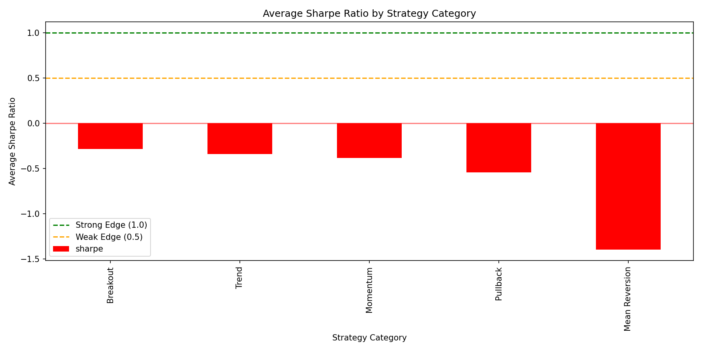
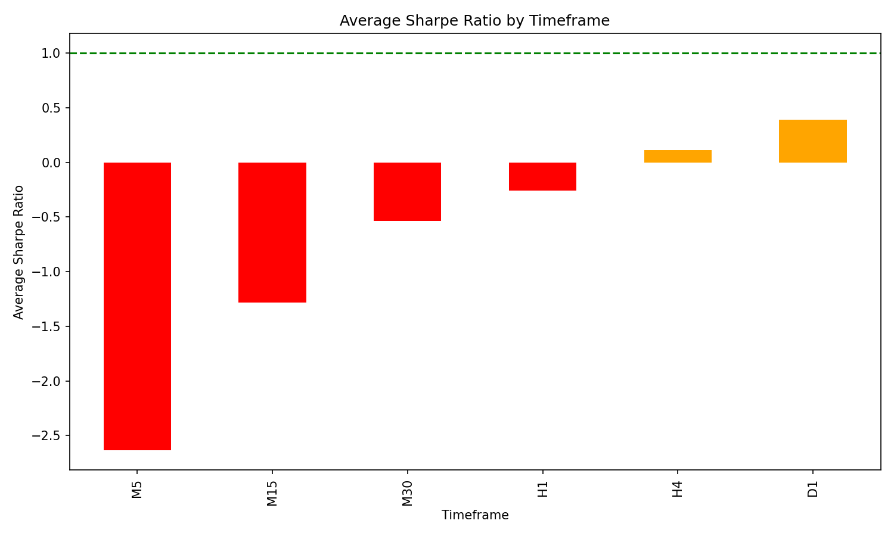
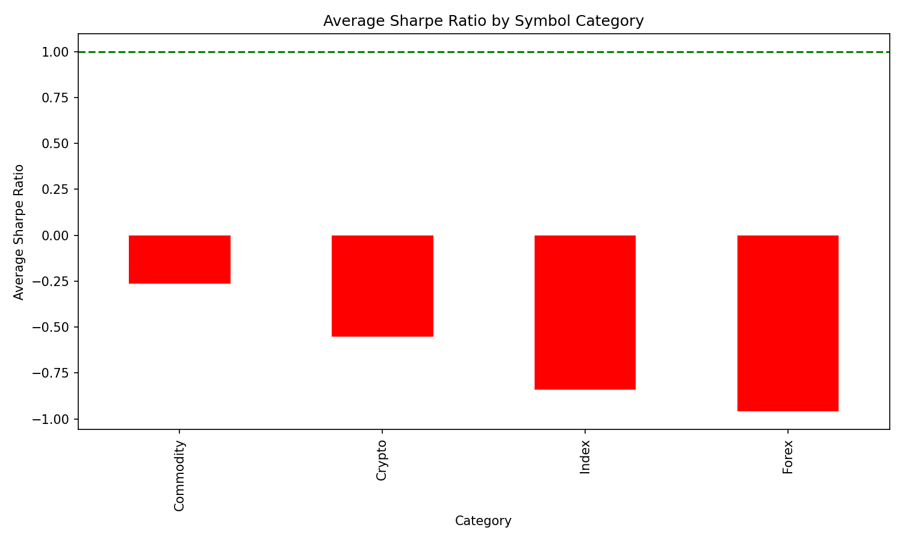
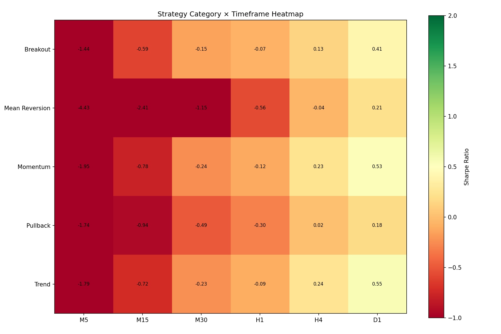

# Comprehensive Strategy Matrix Backtest Report

**Generated**: 2026-01-02 01:13:25

## Test Configuration

| Parameter | Value |
|-----------|-------|
| Strategies | 18 |
| Symbols | 11 |
| Timeframes | 6 |
| Total Combinations | 1188 |
| Valid Results | 972 |

## Summary Statistics

| Metric | Value |
|--------|-------|
| Total Backtests | 972 |
| **Strong Edge (Sharpe >= 1.0)** | **24** (2.5%) |
| Weak Edge (Sharpe 0.5-1.0) | 73 (7.5%) |
| No Edge (Sharpe < 0.5) | 875 (90.0%) |
| Average Sharpe | -0.70 |
| Best Sharpe | 1.39 |
| Worst Sharpe | -12.51 |

## Charts

### Sharpe by Strategy Category

### Sharpe by Timeframe

### Sharpe by Symbol Category

### Strategy × Timeframe Heatmap

## Top 30 Performing Combinations

| Rank | Strategy | Symbol | TF | Sharpe | Return | MaxDD | Win% | Trades |
|------|----------|--------|-----|--------|--------|-------|------|--------|
| 1 | EMA Cross 12/26 (MACD) | ETHUSD | D1 | **1.39** | 4369.59% | -51.86% | 48.3% | 29 |
| 2 | Keltner Channel Break | ETHUSD | D1 | **1.39** | 2330.82% | -41.67% | 64.0% | 25 |
| 3 | EMA Cross 8/21 | BTCUSD | D1 | **1.38** | 1529.74% | -58.02% | 43.6% | 39 |
| 4 | Trend Follow SMA50 | ETHUSD | D1 | **1.37** | 3545.24% | -51.19% | 27.7% | 47 |
| 5 | Keltner Channel Break | BTCUSD | D1 | **1.32** | 783.47% | -38.13% | 46.7% | 30 |
| 6 | EMA Cross 12/26 (MACD) | BTCUSD | D1 | **1.3** | 1253.16% | -57.34% | 43.3% | 30 |
| 7 | Momentum 6-Month | GOLD | D1 | **1.25** | 178.23% | -22.86% | 38.1% | 21 |
| 8 | Trend Follow SMA50 | BTCUSD | D1 | **1.25** | 1066.77% | -56.48% | 23.7% | 59 |
| 9 | Breakout 20/10 | BTCUSD | D1 | **1.21** | 866.96% | -42.18% | 48.1% | 27 |
| 10 | Momentum 12-Month | GOLD | D1 | **1.19** | 166.98% | -28.05% | 35.0% | 20 |
| 11 | Momentum 3-Month | GOLD | D1 | **1.16** | 153.05% | -22.87% | 41.7% | 36 |
| 12 | Trend Follow SMA50 | GOLD | D1 | **1.14** | 139.86% | -20.06% | 26.2% | 61 |
| 13 | EMA Cross 8/21 | ETHUSD | D1 | **1.14** | 1650.73% | -58.39% | 39.0% | 41 |
| 14 | EMA Cross 12/26 (MACD) | GOLD | D1 | **1.11** | 134.71% | -18.61% | 39.4% | 33 |
| 15 | EMA Cross 8/21 | US500Cash | D1 | **1.08** | 110.4% | -15.25% | 51.4% | 35 |
| 16 | EMA Cross 50/200 (Golden) | GOLD | D1 | **1.08** | 145.99% | -31.07% | 28.6% | 7 |
| 17 | EMA Cross 50/200 (Golden) | BTCUSD | D1 | **1.07** | 911.44% | -56.46% | 75.0% | 4 |
| 18 | EMA Cross 12/26 (MACD) | GOLD | H4 | **1.06** | 71.33% | -8.62% | 40.9% | 44 |
| 19 | Turtle Breakout 55/20 | BTCUSD | D1 | **1.04** | 458.52% | -38.97% | 53.3% | 15 |
| 20 | Trend Follow SMA200 | GOLD | D1 | **1.04** | 117.87% | -29.08% | 16.7% | 30 |
| 21 | Breakout 20/10 | ETHUSD | D1 | **1.04** | 981.39% | -50.32% | 51.7% | 29 |
| 22 | EMA Cross 12/26 (MACD) | US500Cash | D1 | **1.04** | 105.52% | -14.93% | 56.0% | 25 |
| 23 | Momentum 12-Month | GOLD | H4 | **1.0** | 81.77% | -10.78% | 37.8% | 37 |
| 24 | EMA Cross 8/21 | GOLD | H4 | **1.0** | 65.04% | -8.54% | 40.9% | 66 |
| 25 | Turtle Breakout 55/20 | GOLD | D1 | **0.99** | 95.6% | -15.15% | 73.3% | 15 |
| 26 | Momentum 6-Month | BTCUSD | D1 | **0.98** | 559.66% | -72.82% | 40.0% | 30 |
| 27 | EMA Cross 50/200 (Golden) | GOLD | H4 | **0.97** | 79.22% | -10.78% | 40.0% | 10 |
| 28 | Momentum 12-Month | BTCUSD | D1 | **0.97** | 593.64% | -61.63% | 40.0% | 5 |
| 29 | Trend Follow SMA50 | SILVER | D1 | **0.95** | 240.63% | -31.48% | 29.8% | 57 |
| 30 | Trend Follow SMA200 | US500Cash | D1 | **0.94** | 93.35% | -19.81% | 22.7% | 22 |

## Performance by Category

### By Strategy Category
- **Breakout**: Avg Sharpe -0.28, Best 1.39, Tests 162
- **Mean Reversion**: Avg Sharpe -1.4, Best 0.9, Tests 324
- **Momentum**: Avg Sharpe -0.39, Best 1.25, Tests 162
- **Pullback**: Avg Sharpe -0.55, Best 0.85, Tests 54
- **Trend**: Avg Sharpe -0.34, Best 1.39, Tests 270

### By Timeframe
- **M5**: Avg Sharpe -2.63, Best 0.19
- **M15**: Avg Sharpe -1.28, Best 0.37
- **M30**: Avg Sharpe -0.54, Best 0.52
- **H1**: Avg Sharpe -0.26, Best 0.51
- **H4**: Avg Sharpe 0.11, Best 1.06
- **D1**: Avg Sharpe 0.39, Best 1.39

### By Symbol
- **SILVER**: Avg Sharpe -0.18, Best 0.95
- **GOLD**: Avg Sharpe -0.35, Best 1.25
- **ETHUSD**: Avg Sharpe -0.41, Best 1.39
- **USDJPY**: Avg Sharpe -0.55, Best 0.84
- **BTCUSD**: Avg Sharpe -0.69, Best 1.38
- **EURUSD**: Avg Sharpe -0.74, Best 0.9
- **US500Cash**: Avg Sharpe -0.84, Best 1.08
- **AUDUSD**: Avg Sharpe -1.23, Best 0.5
- **GBPUSD**: Avg Sharpe -1.32, Best 0.53

## Deployment Recommendations

### Ready for Paper Trading (Sharpe >= 1.0, 20+ trades)
1. **ETHUSD × EMA Cross 12/26 (MACD) (D1)**: Sharpe 1.39, 29 trades
1. **ETHUSD × Keltner Channel Break (D1)**: Sharpe 1.39, 25 trades
1. **BTCUSD × EMA Cross 8/21 (D1)**: Sharpe 1.38, 39 trades
1. **ETHUSD × Trend Follow SMA50 (D1)**: Sharpe 1.37, 47 trades
1. **BTCUSD × Keltner Channel Break (D1)**: Sharpe 1.32, 30 trades
1. **BTCUSD × EMA Cross 12/26 (MACD) (D1)**: Sharpe 1.3, 30 trades
1. **GOLD × Momentum 6-Month (D1)**: Sharpe 1.25, 21 trades
1. **BTCUSD × Trend Follow SMA50 (D1)**: Sharpe 1.25, 59 trades
1. **BTCUSD × Breakout 20/10 (D1)**: Sharpe 1.21, 27 trades
1. **GOLD × Momentum 12-Month (D1)**: Sharpe 1.19, 20 trades

## Data Quality

| Symbol | Timeframe | Bars | Years | Date Range |
|--------|-----------|------|-------|------------|
| ETHUSD | D1 | 2000 | 6.12 | 2019-11-19 to 2026-01-01 |
| BTCUSD | D1 | 2000 | 6.12 | 2019-11-19 to 2026-01-01 |
| GOLD | D1 | 2000 | 7.74 | 2018-04-04 to 2025-12-31 |
| US500Cash | D1 | 2000 | 7.74 | 2018-04-06 to 2025-12-31 |
| GOLD | H4 | 3000 | 1.94 | 2024-01-23 to 2025-12-31 |
| SILVER | D1 | 2000 | 7.74 | 2018-04-04 to 2025-12-31 |
| EURUSD | D1 | 2000 | 7.61 | 2018-05-23 to 2025-12-31 |
| SILVER | H4 | 3000 | 1.94 | 2024-01-23 to 2025-12-31 |
| USDJPY | D1 | 2000 | 7.61 | 2018-05-23 to 2025-12-31 |
| US500Cash | H4 | 3000 | 1.95 | 2024-01-19 to 2025-12-31 |
| ETHUSD | H4 | 3000 | 1.37 | 2024-08-20 to 2026-01-01 |
| BTCUSD | H4 | 3000 | 1.37 | 2024-08-20 to 2026-01-01 |
| GBPUSD | D1 | 2000 | 7.61 | 2018-05-23 to 2025-12-31 |
| SILVER | M30 | 10000 | 0.84 | 2025-02-26 to 2025-12-31 |
| GOLD | H1 | 8000 | 1.36 | 2024-08-22 to 2025-12-31 |
| AUDUSD | D1 | 2000 | 7.61 | 2018-05-23 to 2025-12-31 |
| USDJPY | H4 | 3000 | 1.92 | 2024-01-29 to 2025-12-31 |
| AUDUSD | H4 | 3000 | 1.92 | 2024-01-29 to 2025-12-31 |
| SILVER | H1 | 8000 | 1.36 | 2024-08-22 to 2025-12-31 |
| EURUSD | H4 | 3000 | 1.92 | 2024-01-29 to 2025-12-31 |
| GOLD | M30 | 10000 | 0.84 | 2025-02-26 to 2025-12-31 |
| GBPUSD | H4 | 3000 | 1.92 | 2024-01-29 to 2025-12-31 |
| SILVER | M15 | 15000 | 0.63 | 2025-05-14 to 2025-12-31 |
| USDJPY | M30 | 10000 | 0.8 | 2025-03-12 to 2025-12-31 |
| EURUSD | M30 | 10000 | 0.8 | 2025-03-12 to 2025-12-31 |
| EURUSD | H1 | 8000 | 1.29 | 2024-09-16 to 2025-12-31 |
| SILVER | M5 | 20000 | 0.28 | 2025-09-18 to 2025-12-31 |
| GOLD | M15 | 15000 | 0.63 | 2025-05-14 to 2025-12-31 |
| ETHUSD | H1 | 8000 | 0.91 | 2025-02-02 to 2026-01-01 |
| USDJPY | H1 | 8000 | 1.29 | 2024-09-16 to 2025-12-31 |
| ETHUSD | M30 | 10000 | 0.57 | 2025-06-07 to 2026-01-01 |
| US500Cash | M30 | 10000 | 0.85 | 2025-02-25 to 2025-12-31 |
| AUDUSD | H1 | 8000 | 1.29 | 2024-09-16 to 2025-12-31 |
| USDJPY | M15 | 15000 | 0.6 | 2025-05-26 to 2025-12-31 |
| USDJPY | M5 | 20000 | 0.27 | 2025-09-23 to 2025-12-31 |
| US500Cash | H1 | 8000 | 1.36 | 2024-08-21 to 2025-12-31 |
| GBPUSD | M30 | 10000 | 0.8 | 2025-03-12 to 2025-12-31 |
| EURUSD | M15 | 15000 | 0.6 | 2025-05-26 to 2025-12-31 |
| GOLD | M5 | 20000 | 0.28 | 2025-09-18 to 2025-12-31 |
| GBPUSD | H1 | 8000 | 1.29 | 2024-09-16 to 2025-12-31 |
| BTCUSD | H1 | 8000 | 0.91 | 2025-02-02 to 2026-01-01 |
| US500Cash | M15 | 15000 | 0.64 | 2025-05-13 to 2025-12-31 |
| AUDUSD | M30 | 10000 | 0.8 | 2025-03-12 to 2025-12-31 |
| ETHUSD | M15 | 15000 | 0.43 | 2025-07-29 to 2026-01-01 |
| BTCUSD | M30 | 10000 | 0.57 | 2025-06-07 to 2026-01-01 |
| AUDUSD | M15 | 15000 | 0.6 | 2025-05-26 to 2025-12-31 |
| GBPUSD | M15 | 15000 | 0.6 | 2025-05-26 to 2025-12-31 |
| BTCUSD | M5 | 20000 | 0.19 | 2025-10-24 to 2026-01-01 |
| BTCUSD | M15 | 15000 | 0.43 | 2025-07-29 to 2026-01-01 |
| ETHUSD | M5 | 20000 | 0.19 | 2025-10-24 to 2026-01-01 |
| US500Cash | M5 | 20000 | 0.28 | 2025-09-18 to 2025-12-31 |
| AUDUSD | M5 | 20000 | 0.27 | 2025-09-23 to 2025-12-31 |
| EURUSD | M5 | 20000 | 0.27 | 2025-09-23 to 2025-12-31 |
| GBPUSD | M5 | 20000 | 0.27 | 2025-09-23 to 2025-12-31 |
