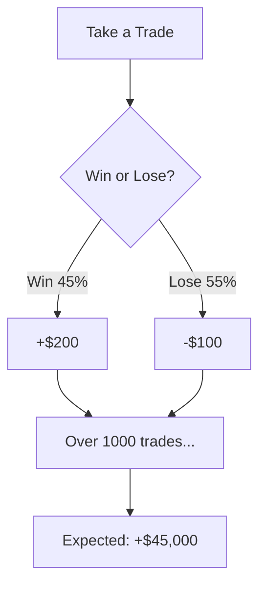

# 📚 Institutional Trading Analysis: Complete Learning Guide

> **"The goal is not to be right more often, but to make money when you're right and lose less when you're wrong."** - Every successful quant

---

## Table of Contents

1. [The Big Picture: Retail vs Institutional Thinking](#the-big-picture)
2. [Win Rate: The Most Overrated Metric](#win-rate)
3. [Expectancy: What Actually Matters](#expectancy)
4. [R-Multiples: Universal Risk Language](#r-multiples)
5. [Profit Factor: The Simple Ratio](#profit-factor)
6. [Statistical Significance: Is It Real or Luck?](#statistical-significance)
7. [Sharpe Ratio: Risk-Adjusted Returns](#sharpe-ratio)
8. [Sortino Ratio: Punish Only the Bad](#sortino-ratio)
9. [Maximum Drawdown: The Pain Threshold](#maximum-drawdown)
10. [Monte Carlo Simulation: Stress Testing](#monte-carlo)
11. [Putting It All Together](#putting-it-together)
12. [Quick Reference Cheat Sheet](#cheat-sheet)

---

<a name="the-big-picture"></a>
## 1. The Big Picture: Retail vs Institutional Thinking 🎯

### The Casino Analogy

Imagine you're running a casino:

| Retail Trader Thinking | Casino/Institutional Thinking |
|------------------------|-------------------------------|
| "I won 6 out of 10 hands!" | "What's my edge per 10,000 hands?" |
| "This strategy has 60% win rate!" | "Is this statistically significant?" |
| "I made $500 today!" | "What's my risk-adjusted return?" |
| "I'll double down to recover" | "Position size based on edge size" |

**The casino doesn't care about winning every hand. They care about having a mathematical edge that plays out over thousands of hands.**

### The Fundamental Question

```
Retail: "Does this strategy win?"
Institution: "Does this strategy have a PROVABLE, REPEATABLE edge that survives transaction costs?"
```

---

<a name="win-rate"></a>
## 2. Win Rate: The Most Overrated Metric ⚠️

### What It Is
```
Win Rate = Number of Winning Trades / Total Trades × 100%
```

### Why Beginners Love It
It's intuitive! 70% win rate sounds better than 40% win rate, right?

### Why It's Misleading

**Story Time: Two Traders**

**Trader A: "The Winner"**
- Win Rate: 80%
- Average Win: $50
- Average Loss: $300
- Net after 10 trades: (8 × $50) - (2 × $300) = $400 - $600 = **-$200** 📉

**Trader B: "The Loser"**
- Win Rate: 30%
- Average Win: $400
- Average Loss: $50
- Net after 10 trades: (3 × $400) - (7 × $50) = $1,200 - $350 = **+$850** 📈

**The "loser" made 4x more money!**

### Visual Representation

```
Trader A's Equity Curve (80% WR, losing money):
$100 ─┐
      │    ╭──╮  ╭─╮
 $80  │   ╭╯  ╰──╯ ╰─╮
      │  ╭╯          ╰──╮
 $60  │ ╭╯              ╰───╮
      │╭╯                   ╰
 $40  └─────────────────────────

Trader B's Equity Curve (30% WR, making money):
$200 ─                        ╭───
      │                    ╭──╯
$150  │                 ╭──╯
      │              ╭──╯
$100  │    ╭────────╯
      │  ──╯
 $50  └─────────────────────────
```

### The Lesson

> **Win rate tells you HOW OFTEN you win. It says nothing about HOW MUCH you win or lose.**

---

<a name="expectancy"></a>
## 3. Expectancy: What Actually Matters 💰

### What It Is

```
Expectancy = (Win Rate × Average Win) - (Loss Rate × Average Loss)
```

Or more simply:
```
Expectancy = Average profit/loss per trade
```

### Multiple Ways to Understand It

#### 🎰 Casino Roulette Analogy

American Roulette has 38 slots (0, 00, and 1-36).
- Betting on a single number: Win = 35× your bet, Lose = 1× your bet
- Probability of winning: 1/38 = 2.63%
- Probability of losing: 37/38 = 97.37%

```
Expectancy = (0.0263 × $35) - (0.9737 × $1)
           = $0.92 - $0.97
           = -$0.05 per dollar bet
```

**Every $1 you bet, you EXPECT to lose $0.05.** That's the casino's edge.

#### 📈 Trading Example

Your strategy:
- Win Rate: 45%
- Average Win: $200
- Average Loss: $100

```
Expectancy = (0.45 × $200) - (0.55 × $100)
           = $90 - $55
           = +$45 per trade
```

**Every trade you take, you EXPECT to make $45 on average.**

### Why Expectancy is Everything



Even though you lose more often than you win, the math works in your favor!

### Quick Expectancy Check Formula

```
Break-even Win Rate = 1 / (1 + Reward/Risk ratio)

If your R:R is 2:1 (risk $1 to make $2):
Break-even WR = 1 / (1 + 2) = 33.3%

You only need to win 34% of the time to be profitable!
```

---

<a name="r-multiples"></a>
## 4. R-Multiples: Universal Risk Language 📏

### The Problem

How do you compare these trades?
- Trade A: Made $500 on EURUSD
- Trade B: Made $50 on USDJPY
- Trade C: Lost $200 on GBPUSD

You can't! Different position sizes, different pip values, different risk.

### The Solution: R-Multiples

**R = The amount you risked on the trade**

```
R-Multiple = Actual P&L / Initial Risk

Trade A: Risked $250, Made $500 → R-Multiple = 500/250 = +2R
Trade B: Risked $25, Made $50   → R-Multiple = 50/25 = +2R
Trade C: Risked $200, Lost $200 → R-Multiple = -200/200 = -1R
```

**Now they're comparable!** Trade A and B both made 2R (doubled their risk).

### R-Multiple Distribution

A healthy strategy should have:

```
Your Trade History in R-Multiples:
+3R  |  █
+2R  |  ████
+1R  |  ██████████
 0R  |  ██
-1R  |  ████████████  ← Most losses should cluster here (your stop loss)
-2R  |  █  ← Very few (slippage, gaps)
```

**Good sign:** Losses clustered at -1R (disciplined stops)
**Bad sign:** Losses scattered from -1R to -3R (letting losers run)

### The Holy Grail: Average R-Multiple

```
Average R = Sum of all R-multiples / Number of trades

If your average R = +0.3R
→ For every $1 risked, you expect to make $0.30

Over 100 trades risking $100 each:
Expected profit = 100 × $100 × 0.3 = $3,000
```

---

<a name="profit-factor"></a>
## 5. Profit Factor: The Simple Ratio 📊

### What It Is

```
Profit Factor = Gross Profits / Gross Losses
```

### The Intuition

**How many dollars do you make for every dollar you lose?**

| Profit Factor | Meaning |
|---------------|---------|
| 0.5 | You lose $2 for every $1 you make → Terrible |
| 1.0 | Break-even (before costs) |
| 1.2 | Make $1.20 for every $1 lost → Marginal |
| 1.5 | Make $1.50 for every $1 lost → Decent |
| 2.0 | Make $2.00 for every $1 lost → Good |
| 3.0+ | Make $3.00 for every $1 lost → Excellent |

### Real Example

```
Your month:
Wins: $500, $300, $450, $200 = $1,450 gross profit
Losses: $100, $150, $100, $200, $100 = $650 gross loss

Profit Factor = $1,450 / $650 = 2.23 ✅
```

### Why It's Useful (and Dangerous)

**Useful:** Quick snapshot of profitability
**Dangerous:** Can be distorted by one big winner

```
Scenario A: 10 trades, 10 wins of $100 each = $1,000 profit
            PF = $1,000 / $0 = ∞ (infinity)
            
Scenario B: 1 trade, 1 big win of $1,000 = $1,000 profit
            PF = $1,000 / $0 = ∞ (infinity)

Same PF, very different reliability!
```

---

<a name="statistical-significance"></a>
## 6. Statistical Significance: Is It Real or Luck? 🎲

### This is THE Most Important Section

Everything above can look great and still be **pure luck**. This section teaches you how to tell the difference.

### The Coin Flip Problem

You flip a coin 20 times and get 12 heads (60%).

**Question:** Is the coin biased, or is this just luck?

**Answer:** This is expected! With 20 flips, you'll often see 55-65% heads even with a fair coin.

### The Trading Version

You backtest a strategy for 20 trades and get 60% win rate.

**Question:** Does the strategy have an edge, or is this just luck?

**Answer:** With only 20 trades, you can't tell! You need statistical testing.

### The p-value Explained (5 Different Ways)

#### Way 1: Plain English
> The p-value is the probability that your results happened by pure chance.

#### Way 2: Court Analogy
Think of statistics like a court trial:
- **Null hypothesis** = "The defendant is innocent" (your strategy has no edge)
- **p-value** = Strength of evidence against innocence
- **p < 0.05** = "Beyond reasonable doubt" (95% confident strategy has an edge)

#### Way 3: The Loaded Dice Test
You suspect someone has loaded dice. You roll 20 times:
- Fair dice average: 3.5
- Your observed average: 4.2

Is the difference:
- **Real** (dice are loaded)? OR
- **Random variation** (just lucky rolls)?

The t-test calculates this!

#### Way 4: The Formula Intuition
```
t-statistic = (Observed Average - Expected Average) / (Standard Error)

In trading:
t = (Your Average R-multiple - 0) / (Standard Deviation of R / √n)
```

High t-statistic → Low p-value → More likely to be real

#### Way 5: Visual

```
Distribution of random strategies (no edge):

                      ┌─────┐
                    ┌─┤     ├─┐
                  ┌─┤ │     │ ├─┐
                ┌─┤ │ │     │ │ ├─┐
              ──┤ │ │ │     │ │ │ ├──
         ◄─────────────────────────────►
        -0.5R        0R         +0.5R

        ═══════════════════════════════
        |←───── 95% of random ─────→|
        
Your strategy: +0.42R  ←─── Falls OUTSIDE the 95% range!
                            ∴ p < 0.05 ✅
```

### The Thresholds

| p-value | Meaning | Action |
|---------|---------|--------|
| p > 0.10 | 90%+ chance it's luck | Reject strategy |
| p < 0.10 | Interesting but inconclusive | Need more data |
| p < 0.05 | **95% confidence it's real** | Worth considering |
| p < 0.01 | **99% confidence it's real** | Strong evidence |
| p < 0.001 | Extremely unlikely to be luck | Very strong edge |

### Why 60 Combinations Became 1

In our backtest:
- 60 symbol-session combinations tested
- Many had positive win rates, profit factors
- But most had p > 0.05 (likely random luck)
- Only **1** had p < 0.05 (BRENT/NY)

**This is why institutions fund quants—not because they have "good ideas" but because they can PROVE the ideas work statistically.**

---

<a name="sharpe-ratio"></a>
## 7. Sharpe Ratio: Risk-Adjusted Returns 📈

### The Problem

Strategy A: +50% return, but wild swings up and down
Strategy B: +30% return, but smooth and steady

Which is better? Depends on your risk tolerance!

### The Solution

```
Sharpe Ratio = Average Return / Standard Deviation of Returns
```

This measures: **"How much return am I getting PER UNIT OF RISK?"**

### Intuition: The Roller Coaster

```
Strategy A (Sharpe = 0.5):         Strategy B (Sharpe = 2.0):
Wild roller coaster                Smooth escalator

   ╭╮  ╭╮                              ╱
  ╭╯╰╮╭╯╰──╮                          ╱
 ╭╯  ╰╯    ╰╮                        ╱
╭╯          ╰╮╭╮                    ╱
╯            ╰╯╰─                  ╱

Exciting but scary                 Boring but reliable
```

### Sharpe Benchmarks

| Sharpe Ratio | Interpretation |
|--------------|----------------|
| < 0 | Losing money |
| 0 - 0.5 | Poor (returns don't justify the risk) |
| 0.5 - 1.0 | Acceptable |
| 1.0 - 2.0 | Good |
| 2.0 - 3.0 | Excellent |
| > 3.0 | Exceptional (hedge fund level) |

### Real Example

```
Trade returns in R-multiples:
+2R, -1R, +1R, -1R, +2R, -1R, +1R, +1R, -1R, +2R

Average = +0.5R
Standard Deviation = 1.27R

Sharpe = 0.5 / 1.27 = 0.39

Interpretation: Below average risk-adjusted returns
```

---

<a name="sortino-ratio"></a>
## 8. Sortino Ratio: Punish Only the Bad 😇

### The Sharpe Problem

Sharpe penalizes ALL volatility—including upside volatility!

If you have a trade that makes +5R instead of +2R:
- Sharpe says: "That's more variance, bad!"
- Sortino says: "That's upside, who cares?"

### The Solution

```
Sortino Ratio = Average Return / Downside Deviation
```

Downside deviation only counts the LOSSES, not the wins.

### When to Use Which

| Situation | Use |
|-----------|-----|
| Comparing overall risk-adjusted performance | Sharpe |
| Evaluating if losses are controlled | Sortino |
| Asymmetric strategies (small losses, big wins) | Sortino gives better picture |

### Our BRENT Example

```
BRENT/NY:
Sharpe = 0.30  (looks mediocre)
Sortino = 1.49 (looks good!)

Why the difference?
→ The wins are bigger than the losses
→ Downside is well-controlled
→ Sortino captures this better
```

---

<a name="maximum-drawdown"></a>
## 9. Maximum Drawdown: The Pain Threshold 📉

### What It Is

```
Maximum Drawdown = Largest peak-to-trough decline
```

### The Story It Tells

Your account goes:
```
$10,000 → $12,000 → $15,000 → $11,000 → $14,000 → $16,000
         (peak)            (trough)              (new peak)

Max Drawdown = ($15,000 - $11,000) / $15,000 = 26.7%
```

At your worst point, you lost 26.7% from your peak.

### Why Institutions Obsess Over This

**Mathematical reality of drawdowns:**

| Drawdown | Recovery Needed |
|----------|-----------------|
| -10% | +11.1% |
| -20% | +25% |
| -30% | +43% |
| -40% | +67% |
| -50% | +100% |
| -60% | +150% |
| -80% | +400% |

**A 50% drawdown requires a 100% gain just to get back to even!**

### The Psychological Reality

```
Your equity at -30% drawdown:

Peak:    ████████████████████████████████████████ $100,000
Current: ████████████████████████████ $70,000

You're thinking:
- "Maybe the strategy stopped working"
- "Should I stop trading?"
- "My wife is asking questions"

This is when most people QUIT, right before the recovery.
```

### Drawdown Duration

Not just how deep, but **how long** you're underwater matters:

```
Strategy A: -30% drawdown, recovered in 2 weeks
Strategy B: -20% drawdown, took 6 months to recover

Which is worse? Strategy B may be psychologically harder!
```

---

<a name="monte-carlo"></a>
## 10. Monte Carlo Simulation: Stress Testing 🎰

### The Problem

Your backtest shows a smooth equity curve. But that's ONE possible sequence of trades.

What if:
- All the losses came first?
- The big winner didn't happen?
- You hit a losing streak early?

### The Solution: Monte Carlo

Take your actual trade results and **randomly reshuffle** them 1000+ times.

### Visualizing Monte Carlo

```
Your actual equity curve:
        ╱╲   ╱╲  ╱
       ╱  ╲ ╱  ╲╱
      ╱    ╱
     ╱   ╱
    ╱  ╱
   ╱ ╱
  ╱╱
 ╱

1000 random reshuffles:
         ╱╲╱╲╱╲╱╲╱╲
        ╱        ╲
       ╱          ╱╲
      ╱╲         ╱  ╲
     ╱  ╲       ╱    ╲
    ╱    ╲     ╱      ╲
───╱──────╲───╱────────╲───
   ↑        ↑           ↑
   path 1   path 500    path 1000
```

### What Monte Carlo Tells You

From our BRENT analysis:
```
Monte Carlo Results (1000 simulations):
- Median final result: +16.8R
- 5th percentile (bad luck): +7.0R
- 95th percentile (good luck): +41.8R
- Probability of profit: 99%
```

**Even in the WORST 5% of scenarios, you still make +7R!**

That's a robust strategy.

### Monte Carlo Red Flags

```
Bad Monte Carlo result:
- Median final: +10R
- 5th percentile: -15R  ← DANGER!
- Probability of profit: 65%

This means: 35% chance of losing money despite positive backtest!
```

---

<a name="putting-it-together"></a>
## 11. Putting It All Together: The Institutional Checklist ✅

When evaluating any strategy, ask these questions in order:

### 1️⃣ First Filter: Statistical Significance
```
Is p < 0.05?
├── NO  → STOP. It's probably luck.
└── YES → Continue...
```

### 2️⃣ Second Filter: Positive Expectancy
```
Is expectancy > 0?
├── NO  → STOP. Losing strategy.
└── YES → Continue... How much?
         • < 0.2R  → Marginal edge
         • 0.2-0.5R → Decent edge
         • > 0.5R  → Strong edge
```

### 3️⃣ Third Filter: Risk-Adjusted Returns
```
Is Sharpe > 0.5?
├── NO  → Returns don't justify the risk
└── YES → Continue... How good?
         • 0.5-1.0 → Acceptable
         • 1.0-2.0 → Good
         • > 2.0   → Excellent
```

### 4️⃣ Fourth Filter: Drawdown Tolerance
```
Is Max Drawdown < 25%?
├── NO  → Can you psychologically handle it?
│        Can your capital survive it?
└── YES → Continue...
```

### 5️⃣ Fifth Filter: Monte Carlo Stress Test
```
Is probability of profit > 80%?
├── NO  → Too much sequence risk
└── YES → Strategy is ROBUST
```

### 6️⃣ Final Filter: Practical Considerations
```
Can you execute it?
• Spread/slippage accounted for?
• Available during trading hours?
• Enough capital for position sizing?
```

---

<a name="cheat-sheet"></a>
## 12. Quick Reference Cheat Sheet 📋

### Formulas

| Metric | Formula | Good Value |
|--------|---------|------------|
| Win Rate | Wins / Total | > 40% (context-dependent) |
| Expectancy | (WR × AvgWin) - (LR × AvgLoss) | > 0 |
| R-Multiple | P&L / Risk | > +0.3R average |
| Profit Factor | Gross Profit / Gross Loss | > 1.5 |
| Sharpe Ratio | Avg Return / Std Dev | > 1.0 |
| Sortino Ratio | Avg Return / Downside Dev | > 1.5 |
| Max Drawdown | (Peak - Trough) / Peak | < 25% |

### Red Flags to Watch For

| Red Flag | What It Means |
|----------|---------------|
| p > 0.05 | Results are probably luck |
| Sharpe < 0.5 | Risk too high for returns |
| Max DD > 40% | Strategy might blow up account |
| Avg Loss > 2R | Not cutting losses properly |
| Too few trades (< 30) | Not enough data to trust |

### The Hierarchy of Importance

```
1. Statistical Significance (p < 0.05)
   └── Without this, nothing else matters
   
2. Positive Expectancy (> 0)
   └── You must have an edge
   
3. Acceptable Drawdown (< 25-30%)
   └── You must survive to profit
   
4. Good Risk-Adjusted Returns (Sharpe > 1)
   └── Returns must justify the risk
   
5. Robustness (Monte Carlo > 80% win)
   └── Edge must persist across scenarios
```

---

## 🎓 Final Wisdom

> **"The markets are a device for transferring money from the impatient to the patient, and from the statistically naive to the statistically sophisticated."**

You now have the knowledge to be on the right side of that transfer.

### Your Next Steps

1. **Apply these metrics** to every strategy you consider
2. **Demand p < 0.05** before risking real money
3. **Calculate expectancy in R-multiples** for standardized comparison
4. **Run Monte Carlo** before trading any new strategy
5. **Size positions** based on Max Drawdown tolerance

---

*Document created: 2025-12-29*
*For: Titan Trading System*
*Purpose: Institutional-grade strategy evaluation*
